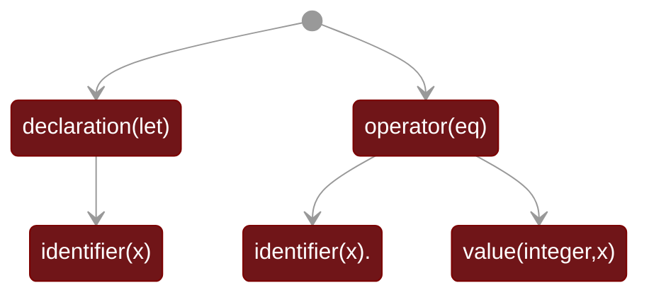

# Expression evaluation structure

`let x = 5`

```mermaid
---
config:
    theme: 'base'
    themeVariables:
        darkMode: false
        primaryColor: '#701518'
        primaryTextColor: '#fff'
        primaryBorderColor: '#7C0000'
        lineColor: '#999'
        secondaryColor: '#006100'
        tertiaryColor: '#fff'
---
stateDiagram-v2

[*] --> declaration(let)
declaration(let) --> identifier(x)

[*] --> operator(eq)
operator(eq) --> identifier(x).
operator(eq) --> value(integer,x)

```
